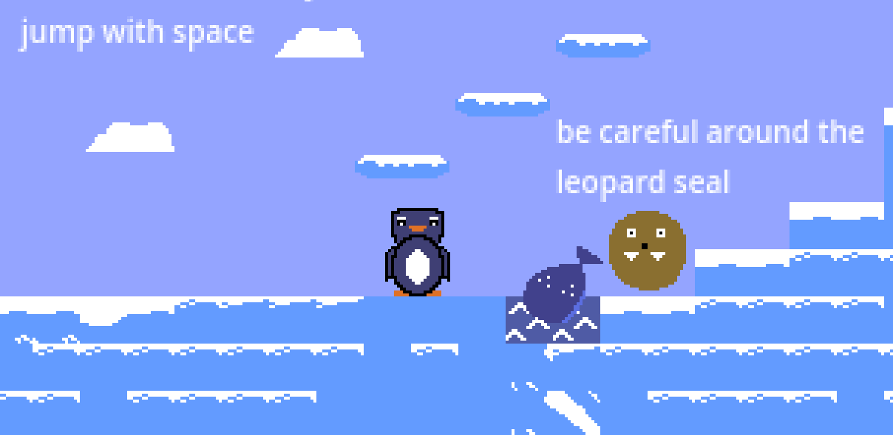

# 🐟 FishHunter

## Description
FishHunter is a simple 2D jump-and-run game developed with **Godot**.

This project is based on the following tutorial and extends it with additional gameplay elements, a darker narrative, and additional features.

- Godot Tutorial:  
  https://www.youtube.com/watch?v=LOhfqjmasi0

The game was developed as part of a **game programming lecture project**.

  

## Gameplay

  

You play as a lone penguin who must collect fish in the frozen wilderness to feed its children.  
Dangerous animals roam the area, and survival depends on careful movement and resource management.

The game consists of **5 progressively harder levels**, each introducing new challenges and enemy types.

In addition to standard snowballs, the player can use **two additional ice-based weapons**.

## Weapons

### ❄️ Snowball
- Basic ranged weapon
- Limited amount
- Used to attack standard enemies

### 🧊 Ice Cube
- Activated with **right mouse button**
- Limited amount
- Freezes **flying enemies**, preventing them from attacking

### ❄️ Giant Snowball
- Special weapon used **only for the boss fight**
- The **only way** to defeat the **Leopard Seal Boss**
- Requires collecting **6 snowballs**
- Activated by **rotating the mouse wheel**

## Boss Fight
The final level features a powerful **Leopard Seal boss**.  
To defeat it, the player must:

- Collect **6 snowballs**
- Activate the **Giant Snowball**
- Use timing and positioning carefully to land the final hits

## Controls
- **Move left/right:** Arrow keys or **A / D**
- **Jump:** Spacebar
- **Shoot snowball:** Left mouse button  
  *(only available if snowballs have been collected)*
- **Ice Cube:** Right mouse button
- **Giant Snowball:** Mouse wheel *(after collecting 6 snowballs)*

## Objective
- Complete all **5 levels**
- Collect all fish
