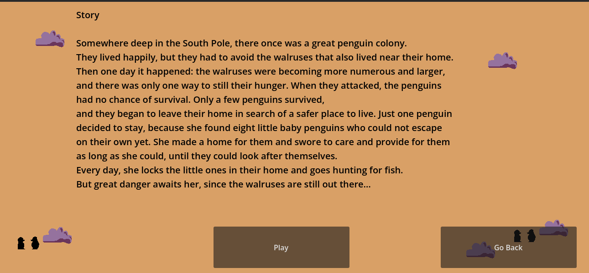

# 🐟 FishHunter

## Description
FishHunter is a simple 2D jump-and-run game developed with **Godot**.

This project is based on the following tutorial and extends it with additional gameplay elements, a darker narrative, and additional features.

- Godot Tutorial:  
  https://www.youtube.com/watch?v=LOhfqjmasi0

The game was developed as part of a **game programming lecture project**.

  

## Gameplay

  

You play as a lone penguin who must collect fish in the frozen wilderness to feed its children.  
Dangerous animals roam the area, and survival depends on careful movement and resource management.

Snowballs can be collected and used as a limited weapon to defend yourself.

### Controls
- **Move left/right:** Arrow keys or **A / D**
- **Jump:** Spacebar
- **Shoot snowball:** Left mouse button  
  *(only available if snowballs have been collected)*

### Objective
- Collect all fish in the level
- Survive encounters with hostile animals
- Use limited resources wisely

